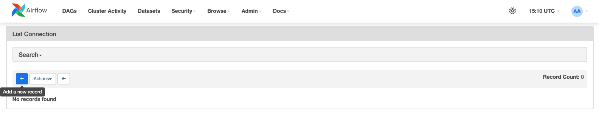
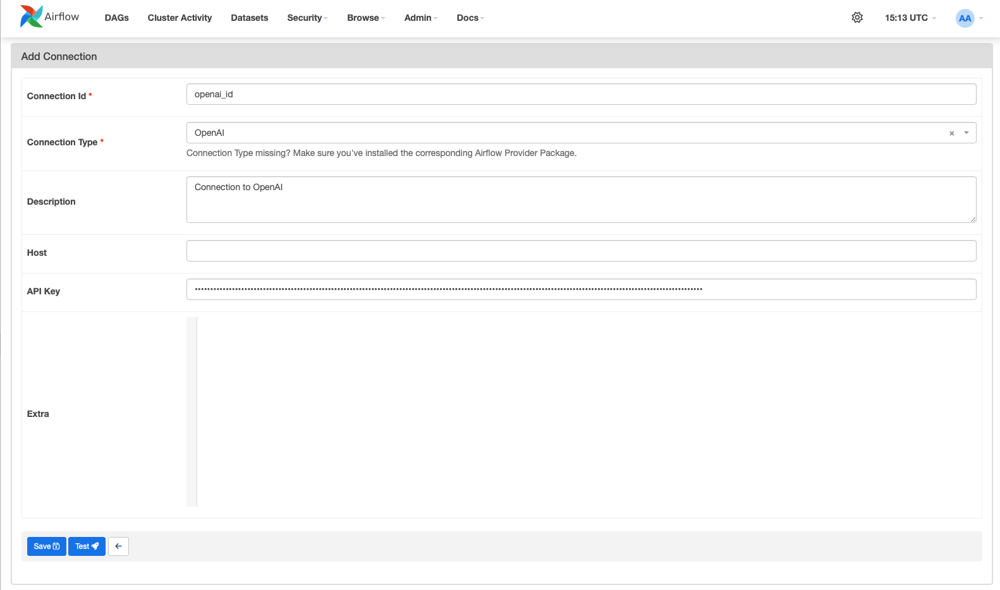
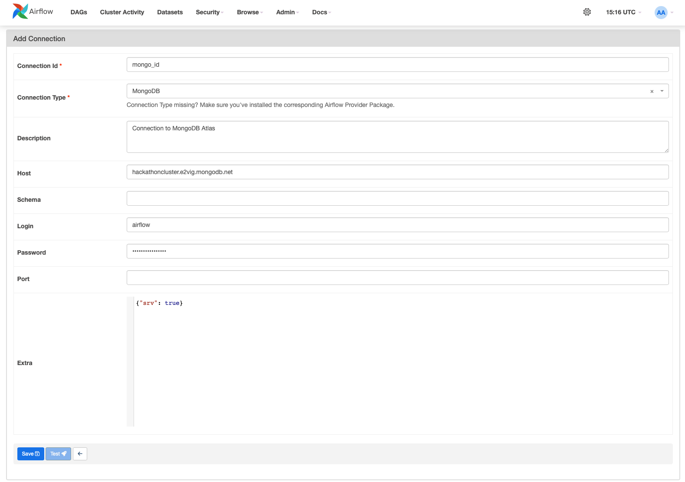
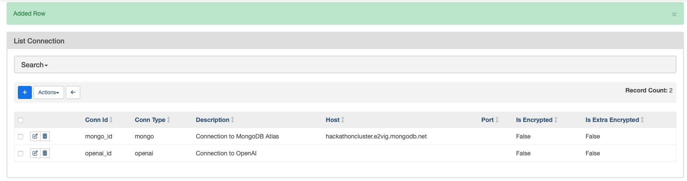
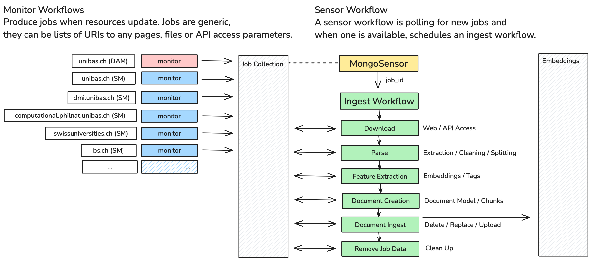
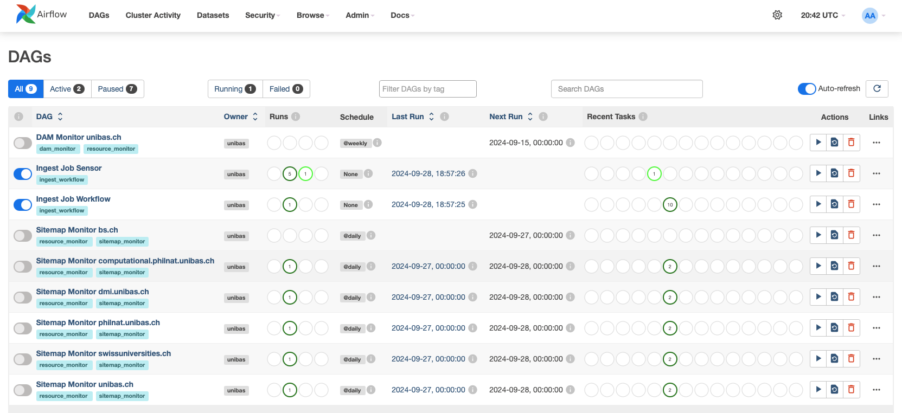

# RAG Hackathon Backend (University of Basel)

This repository contains the backend for the RAG Hackathon project (WIP). The backend is built using Apache Airflow and is responsible for orchestrating the data pipeline.

## What is the RAG Hackathon?
The RAG Hackathon is organized by members of the **University of Basel** and aims to build a **platform** for the universities RAG needs. 

### What is the Backend supposed to do?

The backend aims to separate the data pipeline as a completely separate service. The backend is responsible for orchestrating the data pipeline.
1. Defining **Data Sources**
2. Data Text, Metadata **Extraction**
3. **Data Transformation** / Cleaning / Normalization
4. **Embeddings** Generation, Other **Feature Engineering**
5. **Managing** the Content of **Search Indexes**, Always keeping them up to date.

### What is Apache Airflow?
Apache Airflow is an open-source platform used to programmatically author, schedule, and monitor **workflows**. 
It allows you to create complex **data pipelines** with dependencies, retries, and parallel tasks, making it a popular tool for orchestrating data processing.

For more information, visit the [Apache Airflow website](https://airflow.apache.org/).

## What can the Backend handle currently, what is still missing?

### Data Sources
- [x] Run on schedule / on demand to monitor data sources.
- [x] Extracting Sitemap / Web Content
    * Using `aiohttp` client for async requests. (see [webclient](/dags/unibas/common/logic/logic_web_client.py)).
- [x] Extracting PDF Files from URIs 
    * There is still an issue with DAM content URI head requests for `https://www.unibas.ch/dam/jcr:*` (Will be fixed).
- [ ] Collect referenced links and manage them as well.
    * Currently only specified URIs / Sitemaps are extracted.
    * The backend is already extracting content links, stubbed.

### Data Extraction / Transformation
- [x] Extracting Text from HTML Files
    * Using `beautifulsoup4`
    * Individual handling for domains / paths / sites can be easily defined. (see [parsing logic](/dags/unibas/common/logic/logic_parse.py)).
    * `nltk` for text processing.
- [x] Extracting Metadata from HTML Files (References, Keywords, Author etc.)
- [x] Extracting Text from PDF Files
    * Using `pdfminer3`
    * Individual handling for domains / paths / sites can be easily defined. (see [parsing logic](/dags/unibas/common/logic/logic_parse.py)).
    * `nltk` for text processing.
- [x] Extracting Metadata from PDF Files
- **Extracting Other Content Types**
    * Currently only HTML and PDF are supported.
    * Other content types can be easily added (see [parsing logic](/dags/unibas/common/logic/logic_parse.py)).
- [ ] Excel Sheets / CSV Files / Better Handling for PDFs with Tabular Data
- [ ] Office Documents (Word, PowerPoint etc.)
- [ ] Images / Videos / Audio Files?

### Feature Engineering
- [x] Generating Embeddings for Text with OpenAI
- [ ] Generating Embeddings for Text with Other Providers
- [x] Generating Tags for Text with OpenAI (see [prompt logic](/dags/unibas/common/logic/logic_prompt.py))
  - Prompt Logic is currently a placeholder and can be easily extended.
- [ ] Generating Tags for Text with Other Providers
- [ ] Generating Other Features
    * Currently only embeddings and tags are generated.

### Search Index Management
- [x] Updating Documents in Search Index
- [ ] Creating Documents that can be directly used by the existing frontend.
  * The MongoDB provided frontend is not yet integrated with the backend.
  * The backend is already providing the necessary data for the frontend, but the frontend can not yet use it.
  * See also (#Integration with Frontend).


## Setup Guide

The backend is built using Apache Airflow and Docker (This is currently the case. For production, a kubernetes cluster is preferable).
In the current state, it can be run locally in a docker container. 

### Requirements
* Python 3.12
* Install docker. (Either [Docker Desktop](https://www.docker.com/products/docker-desktop) for Windows / Mac or [Docker Engine](https://docs.docker.com/engine/install/) for Linux)
* Install docker-compose. (Usually included in the Docker Desktop installation)
* Clone this repository.
* Source the .venv file to activate the virtual environment
```shell
source .venv/bin/activate
```
* Install the requirements with 
```shell
pip install -r requirements.txt
```
### Setup
* Copy the `example.env` file to `.env` and set your environment variables. 
  * Read the comments in the [example.env](example.env) file for more information.
* Run the `setup.sh` script. (This will build the docker containers and start the backend.)
```shell
./setup.sh
```
* You may have to change the permissions of the `setup.sh` and `run_tests.sh` files to make them executable.
  ```shell
  chmod +x setup.sh; chmod +x run_tests.sh
  ```
* What does the Setup Script do?
  * You can read it in the [setup.sh](./setup.sh) file.
  * It runs `pytest` to test the backend (Which can also be run manually with the [run_tests.sh](./run_tests.sh) file.).
  * It generates the `init.db` file for the Airflow postgres instance from your environment variables.
  * It calls docker to compose the [docker-compose.yml](/docker-compose.yml) to initialize 3 containers (Airflow Webserver, Airflow Scheduler, Airflow Postgres).
  * It waits for the Airflow Webserver to be ready and then tells you to login, with user and password from the CLI.

### In the Webserver UI

Like mentioned in the [example.env](example.env), the connection data (secrets for MongoDB, OpenAI etc.) 
can be set in the Airflow Webserver UI. Navigate under `Admin -> Connections`.

<div 
  style="display: flex; flex-direction: column; align-items: center; justify-content: center; gap: 20px;"
>
  <caption>Add new connections under the connection list.</caption>
  
  <caption>Add a connection for OpenAI using the Connection ID from the environment variables.</caption>
  
  <caption>Add a connection for MongoDB using the Connection ID from the environment variables.</caption>
  
  
</div>

## Running the Backend (And changing the code)

### Developing locally.

The folders `/dags` and `/plugins` and `/data` are mounted into the docker containers.
This means you can change the code in your local environment and the changes will be reflected in the docker containers.
Airflow reparses the DAGs every few seconds and will pick up the changes automatically.

The code is currently grouped into logic and model (subject to change).
* The [logic code](./dags/unibas/common/logic) is responsible for the actual processing of the data.
* The [model code](./dags/unibas/common/model) is responsible for the data structures / serialization / deserialization.
  * Uses `pydantic 2.x` for data validation.
* The [dags code](./dags/unibas/dags) is responsible for the actual Airflow DAG definition.
  * It interacts with logic and model code through either
    * [monitoring code](./dags/unibas/common/monitoring.py) (for monitoring data sources)
    * [processing code](./dags/unibas/common/processing.py) (for processing the data)
* Finally, there are tests in the [tests](./dags/unibas/test/) folder.

### Architecture

The backend consists of DAGs (or Workflows) managed by the Airflow Scheduler. Each "Task" in a DAG is an isolated unit of work that can be run in parallel with other tasks.
* The monitoring DAGs produce jobs, which contain information about which data sources need to be ingested.
* The sensor workflow waits for new jobs to be created and then triggers the ingest workflow with their `job_id`.
* The ingest workflow processes the jobs, moving them through predefined steps and updating the job data in the collection.
* Finally, the finished document chunks are updated in the search index and the job data is deleted.


<div 
  style="display: flex; flex-direction: column; align-items: center; justify-content: center; gap: 20px;"
>

</div>

### In the Webserver UI

You can monitor the progress of the DAGs in the Airflow Webserver UI. You can also trigger, pause and resume the DAGs from there.
You can see the logs of the tasks and the progress of the DAGs.
If you want to test it, and you have everything set up:
1. Unpause the `Ingest Job Workflow` DAG. (Processing DAG)
   - This will make it available to be triggered.
2. Trigger the `Ingest Job Sensor` DAG. (Sensor DAG)
   - This will enable the sensor to wait for new jobs and trigger the processing DAG.
3. Unpause Monitoring DAGs.
   - This will make the monitoring DAGs follow their schedule and create new jobs.
   - By default, they are running once when un-paused and then daily.

<div 
  style="display: flex; flex-direction: column; align-items: center; justify-content: center; gap: 20px;"
>

</div>


## Integration with Frontend

The backend is currently not integrated with the frontend. To integrate the backend with the frontend the data models have to be aligned.

Currently, the backend is providing the following data chunk format (**Example (WIP)**):

```json
{
  "_id": {
    "$oid": "66f87529b04edd0e875ca5a8"
  },
  "resource_type": "document_chunk",
  "text": "Description: The seminar will address the topic of the impact of AI on: the economy, the environment, and society . On the first date, an introduction into the topic and into the form of the seminar will be give...[...]",
  "embedding": [
    0.009043736383318901,
    -0.044048476964235306,
    0.028220245614647865,
    -0.004187040496617556,
    -0.0014948883326724172,
    0.021672500297427177,
    "..."
  ], 
  "tags": {
    "intended_audience": [
      "Current students",
      "PhD candidates",
      "International students"
    ],
    "departments": [
      "Department of Mathematics and Computer Science"
    ],
    "faculties": [],
    "administrative_services": [],
    "degree_levels": [
      "Master",
      "PhD"
    ],
    "topics": [
      "Research Opportunities",
      "Career Development"
    ],
    "information_type": [
      "Procedural Information",
      "Program Details",
      "Application Instructions"
    ],
    "keywords": [
      "AI",
      "economy",
      "environment",
      "society",
      "seminar",
      "team presentation",
      "Eucor",
      "sustainability",
      "guest speakers",
      "collaboration",
      "ethical implications"
    ],
    "entities_mentioned": [
      "E. Baudrier",
      "D. Ruire",
      "Amanda Sessim Parisenti",
      "University of Basel",
      "Université de Haute-Alsace",
      "Universität Freiburg",
      "Moodle platform",
      "Eucor seminar 2023"
    ]
  },
  "metadata": {
    "created_at": {
      "$date": "2024-09-28T21:29:07.007Z"
    },
    "lastmod": {
      "$date": "2024-09-22T21:23:01.000Z"
    },
    "document_id": "https://dmi.unibas.ch/de/studium/computer-science-informatik/lehrangebot-hs24/seminar-eucor-seminar-in-computer-science/",
    "attributes": {
      "attribute_type": "html_attributes",
      "title": "Seminar Eucor Seminar in Computer Science | Departement \r\nMathematik und Informatik | Universität Basel",
      "author": null,
      "date": null,
      "description": null,
      "keywords": null,
      "links": {
        "_id": {
          "$oid": "66f87513072aefcdc3ec46ba"
        },
        "origin": "https://dmi.unibas.ch/de/studium/computer-science-informatik/lehrangebot-hs24/seminar-eucor-seminar-in-computer-science/",
        "urls": [] 
      }
    },
    "chunk_id": "https://dmi.unibas.ch/de/studium/computer-science-informatik/lehrangebot-hs24/seminar-eucor-seminar-in-computer-science/_0",
    "chunk_index": 0
  }
}

```

## Adding Data Sources / Changing the Content Filters

Currently, the content is filtered as follows. To Change this you can edit the monitor DAGs in the [dags](./dags/unibas/dags) folder.

| Category | URL |
|----------|-----|
| General – Life in Basel | https://www.bs.ch/Portrait/leben-in-basel.html |
| General – Life in Basel | https://www.bs.ch/Portrait/leben-in-basel/wohnen-in-basel.html |
| General – Life in Basel | https://www.bs.ch/Portrait/leben-in-basel/Gesundheit-und-Versicherung.html |
| General – Life in Basel | https://www.unibas.ch/de/Arbeiten-an-der-Universitaet-Basel/Leben-in-Basel.html |
| General – Life in Basel | https://www.unibas.ch/de/Universitaet/Administration-Services/Vizerektorat-Forschung/Nationale-und-Internationale-Zusammenarbeit/Welcome-Center.html |
| UNIBAS – general Study-related Documents | https://www.unibas.ch/de/Studium/Bewerbung-Zulassung/Anmeldung/Bachelorstudium-mit-schweizerischem-Vorbildungsausweis/Verspaetete-Anmeldung-zum-Bachelorstudium-mit-schweizerischem-Vorbildungsausweis.html |
| UNIBAS – general Study-related Documents | https://www.unibas.ch/de/Studium/Bewerbung-Zulassung/Anmeldung/Bachelorstudium-mit-auslaendischem-Vorbildungsausweis/Verspaetete-Anmeldung-zum-Bachelorstudium-mit-auslaendischem-Vorbildungsausweis.html |
| UNIBAS – general Study-related Documents | https://www.unibas.ch/de/Studium/Bewerbung-Zulassung/Anmeldung/Masterstudium-ausser-Medizin-und-Pflegewissenschaft/Verspaetete-Anmeldung-zum-Masterstudium-mit-schweizerischem-Hochschulabschluss.html |
| UNIBAS – general Study-related Documents | https://www.unibas.ch/de/Studium/Bewerbung-Zulassung/Zulassung/Medizin.html |
| UNIBAS – general Study-related Documents | https://www.swissuniversities.ch/service/anmeldung-zum-medizinstudium/eignungstest |
| UNIBAS – general Study-related Documents | https://www.unibas.ch/de/Studium/Campus-Stories/wie-man-sich-am-besten-auf-den-eignungstest-fuer-das-medizinstudium-ems-vorbereitet.html |
| (Re-)Registration / Leave of Absence | https://www.unibas.ch/de/Studium/Im-Studium/Rueckmelden.html |
| Course Auditors | https://www.unibas.ch/de/Studium/Mobilitaet/Mobilitaet-Schweiz/Belegen-Studierende-anderer-Schweizer-Universitaeten.html |
| Exmatriculation | https://www.unibas.ch/de/Studium/Im-Studium/Rueckmelden.html |
| Data Transcript | https://www.unibas.ch/de/Studium/Im-Studium/Datenabschrift.html |
| Questions on Admission | https://www.unibas.ch/de/Studium/Bewerbung-Zulassung.html |
| Questions on Admission | https://www.unibas.ch/dam/jcr:756fd26f-ea10-4aa2-ad28-e433b15d42e0/Zulassungsrichtlinien%20Universitaet%20Basel-akademisches%20Jahr%202024_25.pdf |
| Studying without Barriers | https://www.unibas.ch/de/Studium/Beratung/Soziales-Gesundheit/Behinderung-Krankheit.html |
| General Study-related information | https://www.unibas.ch/de/Studium/Im-Studium/ |
| Course catalog | https://vorlesungsverzeichnis.unibas.ch/en/home |
| Faculty of Science | https://philnat.unibas.ch/de/studium/ |
| Faculty of Science | https://philnat.unibas.ch/de/faqs/ |
| General Information Bachelor’s Studies | https://philnat.unibas.ch/de/studium/ |
| General Information Bachelor’s Studies | https://www.unibas.ch/dam/jcr:c67b41e1-b339-4404-91ae-7a60a66a7a28/446_710_11.pdf |
| General Information Bachelor’s Studies | https://philnat.unibas.ch/de/studium/bachelor/ |
| General Information Master’s Studies | https://philnat.unibas.ch/de/studium/ |
| General Information Master’s Studies | https://www.unibas.ch/dam/jcr:a9ec4dd3-7e20-4dea-bed8-0c5898ab8bd6/446_720_00.pdf |
| General Information Master’s Studies | https://philnat.unibas.ch/de/studium/master/ |
| Extra-Faculty Curricula | https://philnat.unibas.ch/de/studium/ausserfakultaere-studienfaecher/ |
| Exams | https://philnat.unibas.ch/de/examen/ |
| IT Tools for Studying | https://philnat.unibas.ch/de/studium/ |
| General Documents | https://philnat.unibas.ch/de/forschung/promotionphd/ |
| PhD | https://philnat.unibas.ch/de/forschung/promotionphd/immatrikulation-ab-hs-2016-registered-fall-semester-2016-or-later/ |
| PhD | https://philnat.unibas.ch/de/forschung/promotionphd/doktoratsprogramme/ |
| PhD Programs | https://philnat.unibas.ch/de/termine-aktuelles/ |
| Dates | https://dmi.unibas.ch/de/studium/computer-science-informatik/ |
| Curricula Computer Science | https://dmi.unibas.ch/de/vorkurs-mathematik/ |
| Math pre-course | https://dmi.unibas.ch/de/studium/computer-science-informatik/lehrangebot-hs24/ |
| Course Offers | https://dmi.unibas.ch/de/studium/mathematik/ |
| Curricula Mathematics | https://dmi.unibas.ch/de/studium/actuarial-science/ |
| Curricula Actuarial Science | https://dmi.unibas.ch/de/studium/data-science/ |
| Curricula Data Science | https://computational.philnat.unibas.ch/de/ |
| Curricula Computational Sciences | https://www.unibas.ch/dam/jcr:b66fd5f1-f778-4a4e-b554-d516e1714968/446_330_07.pdf |

